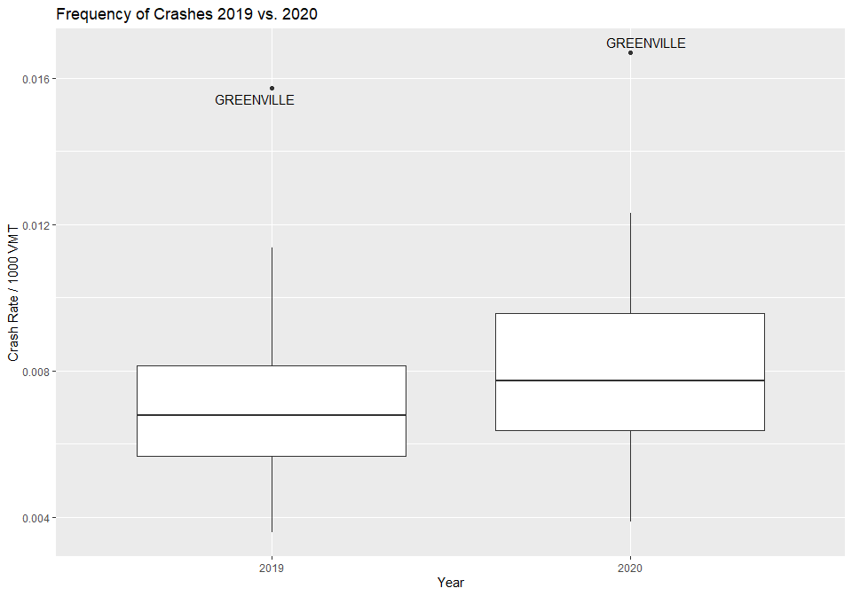
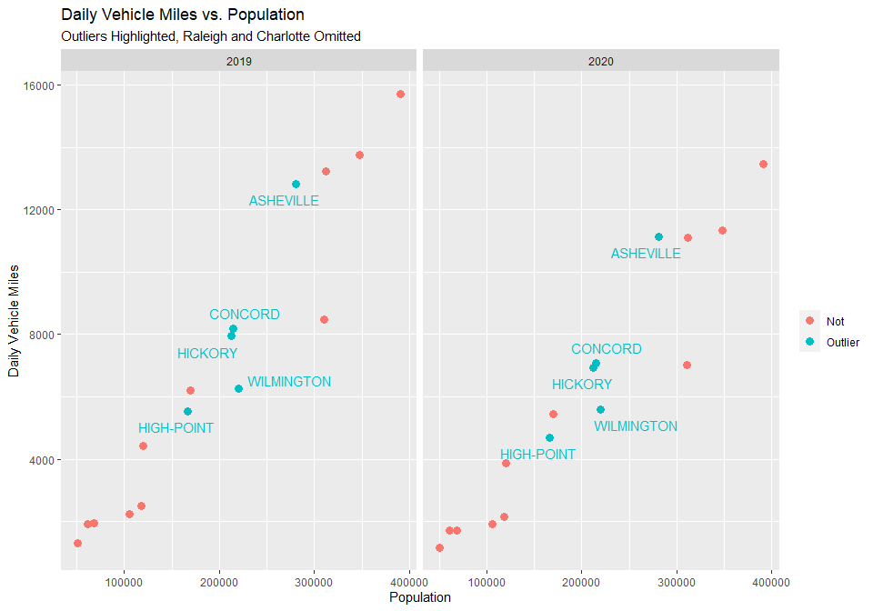
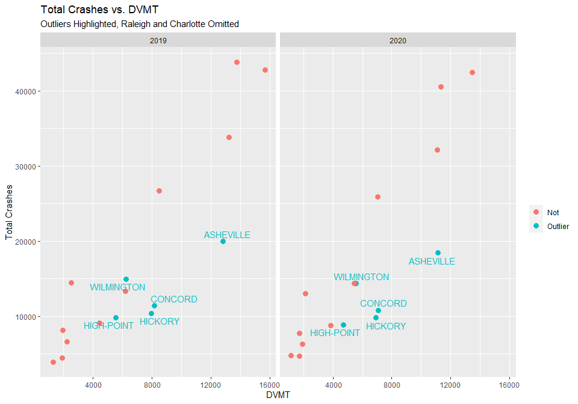
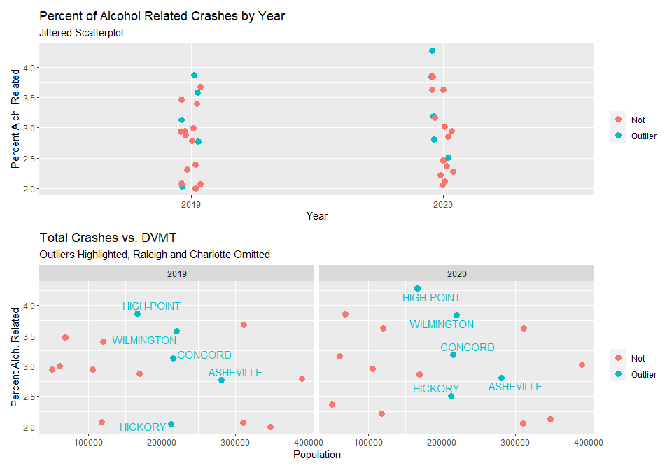

Post Covid Driving Analysis
================
Holt Menzies

``` r
library(tidyr)
library(readr)
# Leave out messages about overlapping functions
suppressPackageStartupMessages(library(dplyr))
library(stringr)
library(ggplot2)
library(ggrepel)
library(patchwork)

## Constants

# Size of points for scatter plot
# 6 is max default is 1
scatter_size <- 3

# Population threshold for outliers
pop_threshold = 750000
```

# Research Question and Methods

COVID-19 has dramatically affected almost every aspect of modern life,
including the frequency of traveling by car. Since personal and work
travel have started to become more common again, I have experienced more
hectic experience times on the road.

Has the competence of the driving population decreased since the start
of COVID-19? Using traffic data, I will compare rates of accidents to
answer this question. Road accidents are an indication of driver
competence.

## Methods

To assess the competence of drivers on the road I am going to use rates
of automotive accidents before and after the onset of COVID-19. The
following information on car crashes comes from Raleigh, North Carolina,
for initial analysis.

| Year | Total Crashes |
|-----:|--------------:|
| 2018 |         25315 |
| 2019 |         26567 |
| 2020 |         17398 |
| 2021 |         20848 |
| 2022 |         14614 |

There is a sharp drop in the number of accidents between 2019 and 2020.
The volume of traffic in many places dropped significantly during COVID
lockdowns. To focus on the rate of accidents (not the absolute amount) a
rate of accidents per 1,000 Vehicle Miles Traveled (VMT) will be used.

$$
Annual \ Crash \ Rate = \frac{Crashes_{year}}{DVMT * 365} 
$$

Note that the Daily Vehicle Mile data (DVMT) from the Federal Highway
Administration is already in units of 1,000s of miles, so it is not
divided by 1,000 a second time.

The focus of this study will be on medium to large urban areas in North
Carolina. North Carolina has 20 cities with a population greater than or
equal to 50,000. Of those 20 cities, 18 of them are included in the
Federal Highway Administration’s *Highway Statistics Series*. The
Highway Statistics Series offers yearly estimates of traffic volume in
vehicle miles.

Nowhere in North Carolina was entirely isolated from the effects of
COVID-19 or the resulting lockdowns. Measuring the prevalence of crashes
between cities that were not affected vs. those that were by the
pandemic is unfeasible. Therefore, the information from each city will
be treated as paired data. For each city, the 2019 rate will be
subtracted from the crash rate for 2020.

$$
\Delta Rate = Rate_{city, 2020} - Rate_{city, 2019}
$$ A positive value indicates an increase in the crash rate. A negative
value indicates a decrease in the crash rate in 2020.

To answer the question of if driver competence has decreased after the
onset of COVID-19 the differences in crash rates will be compared. A
paired t-test will be used to generate a p-value and 95% Confidence
Interval for the likely change in rate. Additionally a linear regression
will be used to find whether city size affects the accident rate.

# Data Ingestion and Cleaning

## Bringing in the Data

``` r
crash_2019 <- read_table("NC_DOT_Crash_City_2019_10000.txt", 
                         col_names = FALSE)
```

    ## 
    ## ── Column specification ────────────────────────────────────────────────────────
    ## cols(
    ##   X1 = col_character(),
    ##   X2 = col_number(),
    ##   X3 = col_character(),
    ##   X4 = col_double(),
    ##   X5 = col_number(),
    ##   X6 = col_character(),
    ##   X7 = col_double(),
    ##   X8 = col_double(),
    ##   X9 = col_double()
    ## )

``` r
crash_2020 <- read_table("NC_DOT_Crash_City_2020_10000.txt", 
    col_names = FALSE)
```

    ## 
    ## ── Column specification ────────────────────────────────────────────────────────
    ## cols(
    ##   X1 = col_character(),
    ##   X2 = col_number(),
    ##   X3 = col_character(),
    ##   X4 = col_double(),
    ##   X5 = col_number(),
    ##   X6 = col_double(),
    ##   X7 = col_double(),
    ##   X8 = col_double(),
    ##   X9 = col_double()
    ## )

``` r
vmt_2019 <- read_csv("2019_combined.xlsx - A.csv")
```

    ## Rows: 493 Columns: 15

    ## ── Column specification ────────────────────────────────────────────────────────
    ## Delimiter: ","
    ## chr (1): FEDERAL-AIDURBANIZED  AREA  (1)
    ## dbl (4): MILES  OFROADWAYPER  1,000PERSONS, TOTALDVMT  (2)PERCAPITA, TOTALMI...
    ## 
    ## ℹ Use `spec()` to retrieve the full column specification for this data.
    ## ℹ Specify the column types or set `show_col_types = FALSE` to quiet this message.

``` r
vmt_2020 <- read_csv("2020_combined.xlsx - A.csv")
```

    ## Rows: 493 Columns: 15
    ## ── Column specification ────────────────────────────────────────────────────────
    ## Delimiter: ","
    ## chr (1): FEDERAL-AIDURBANIZED  AREA  (1)
    ## dbl (4): MILES  OFROADWAYPER  1,000PERSONS, TOTALDVMT  (2)PERCAPITA, TOTALMI...
    ## 
    ## ℹ Use `spec()` to retrieve the full column specification for this data.
    ## ℹ Specify the column types or set `show_col_types = FALSE` to quiet this message.

## Tidying

``` r
# Splitting State info
vmt_2020 <- vmt_2020 %>% 
  separate(`FEDERAL-AIDURBANIZED  AREA  (1)`, into = c("City", "State"), sep = ",")


vmt_2019 <- vmt_2019 %>% 
  separate(`FEDERAL-AIDURBANIZED  AREA  (1)`, into = c("City", "State"), sep = ",")

# Trim white space
vmt_2019 <- vmt_2019 %>% 
  mutate(across(where(is.character), str_trim))

vmt_2020 <- vmt_2020 %>% 
  mutate(across(where(is.character), str_trim))
```

### Tidy Crash Data

``` r
# Adding Column Names to crash data, Just changing default names
crash_cols <- c("City", "Total Crashes", "%Alch Related", 
                "Fatal Crashes", "Non-Fatal Crashes", "Rank 2017", 
                "Rank 2018", "Rank 2019", "Rank 2020")

colnames(crash_2019) <- crash_cols
colnames(crash_2020) <- crash_cols
```

## Narrow to NC data

``` r
vmt_NC_2019 <- vmt_2019  %>% 
  filter(State == "NC" | State == "NC--SC")

vmt_NC_2020 <- vmt_2020  %>% 
  filter(State == "NC" | State == "NC--SC")
```

## Make uniform format and join data frames

``` r
# Change format of vmt data to match whats in the Crash data
# All upper case, all spaces replaced with "-
vmt_NC_2019 <- vmt_NC_2019 %>% 
  mutate(City = str_to_upper(City)) %>% 
  mutate(City = str_replace_all(City, " ", "-"))

vmt_NC_2020 <- vmt_NC_2020 %>% 
  mutate(City = str_to_upper(City)) %>% 
  mutate(City = str_replace_all(City, " ", "-"))
```

### Joing data

``` r
comb_2019 <- vmt_NC_2019 %>% 
  select(City, `TOTALDVMT  (2)(1,000)`, CENSUSPOPULATION) %>% 
  inner_join(crash_2019, by="City") %>% 
  mutate(Year = 2019) %>% 
  select(-(`Rank 2017`:`Rank 2020`))


comb_2020 <- vmt_NC_2020 %>% 
  select(City, `TOTALDVMT  (2)(1,000)`, CENSUSPOPULATION) %>% 
  inner_join(crash_2020, by="City") %>% 
  mutate(Year = 2020) %>% 
  select(-(`Rank 2017`:`Rank 2020`))
```

``` r
all_years <- rbind(comb_2019, comb_2020)

colnames(all_years)[2] <- "DVMT"
colnames(all_years)[3] <- "POP"

all_years <- all_years %>% 
  mutate(crash_rate = `Total Crashes` / (DVMT * 365),
         alcohol_num = parse_number(`%Alch Related`))

paired_rate <- all_years %>% 
  select(City, Year, crash_rate) %>% 
  spread(Year, crash_rate) %>% 
  mutate(crash_dif = `2020` - `2019`) # difference in years

# Add Population to paired Data
paired_rate <- paired_rate %>% 
  inner_join(subset(all_years, all_years$Year == 2020)[c("City", "POP")], by="City")
```

# Data Exploration

## Summary Data

``` r
#summary(paired_rate) %>% 
#  knitr::kable()

sum_table <- tibble(Value = c("Min", "1st Quarter", "Median", "Mean", "3rd Quarter", "Max"),
                    `2019 Crash Rate`= c(0.003587, 0.005669, 0.006779, 0.007218, 0.008133, 0.015732),
                    `2020 Crash Rate`= c(0.003869, 0.006376, 0.007721, 0.008128, 0.009575, 0.016688),
                    `Rate Difference` = c(0.0002677, 0.0005017, 0.0008716, 0.0009095, 0.0011128, 0.0029975))

knitr::kable(sum_table)
```

| Value       | 2019 Crash Rate | 2020 Crash Rate | Rate Difference |
|:------------|----------------:|----------------:|----------------:|
| Min         |        0.003587 |        0.003869 |       0.0002677 |
| 1st Quarter |        0.005669 |        0.006376 |       0.0005017 |
| Median      |        0.006779 |        0.007721 |       0.0008716 |
| Mean        |        0.007218 |        0.008128 |       0.0009095 |
| 3rd Quarter |        0.008133 |        0.009575 |       0.0011128 |
| Max         |        0.015732 |        0.016688 |       0.0029975 |

## Looking at the distribution of crash rates by year.

``` r
all_years %>% 
  mutate(outlier = ifelse(crash_rate > 1.7 * mean(crash_rate), City, as.numeric(NA))) %>% 
  ggplot(aes(y = crash_rate, x = factor(Year))) +
  geom_boxplot() +
  labs(title = "Frequency of Crashes 2019 vs. 2020", y = "Crash Rate / 1000 VMT", 
       x = "Year") +
  geom_text_repel(aes(label = outlier), na.rm = T)
```

<!-- -->

Box plots that show the distribution of crash rates by city for 2019 and
2020 show fairly similar variance. For both years, Greenville, NC is a
major outlier. There do not appear to be any obvious violations of the
t-tools assumptions.

## Distributions of Population, Crashes, and Vehicle Miles

``` r
par(mfrow=c(2,3))
hist(xlab = "", main = "Population 2019", subset(all_years, Year == 2019)$POP)
hist(xlab = "", main = "Total Crashes 2019", subset(all_years, Year == 2019)$`Total Crashes`)
hist(xlab = "", main = "DVMT 2019", subset(all_years, Year == 2019)$DVMT)
hist(xlab = "", main = "Population 2020", subset(all_years, Year == 2020)$POP)
hist(xlab = "", main = "Total Crashes 2020", subset(all_years, Year == 2020)$`Total Crashes`)
hist(xlab = "", main = "DVMT 2020", subset(all_years, Year == 2020)$DVMT)
```

<!-- -->

``` r
par(mfrow=c(1,1))
```

Note that the city population supplied by the Federal Highway
Administration Vehicle Miles data is the same for 2019 and 2020 for all
NC cities.

## Difference in Crash Rate vs. Population

``` r
#plot(paired_rate$crash_dif ~ subset(all_years, Year == 2020)$POP,
#     main = "Difference in Crash Rate vs. Population (2020)",
#     ylab = "Change in Crash Rate",
#     xlab = "Population")

paired_rate %>% 
  ggplot(aes(x=POP,
             y=crash_dif)) +
  geom_point(size = scatter_size) +
  labs(title = "Difference in Crash Rate vs. Population (2020)",
     y = "Change in Crash Rate",
     x = "Population") +
  geom_text_repel(aes(label = City),
                  data = subset(paired_rate, crash_dif > 0.0025 | POP > pop_threshold))
```

<!-- -->

The scatter plot suggests that there might be some association between
change in crash rate and population up to around 400,000 people. Because
there are no observations with populations between 400,000 and 800,000
it is difficult to assess whether those are observations with unusually
low change in crash rates or indicative of some other trend in the data.

Transformations of population do not help.

### Investigating Cases with Low Differences in Crash Rate

There are three notable outliers, two with much larger populations and
one with an extremely high increase in crash rate. The following scatter
plot shows the observations with the outliers removed. With the New Bern
observation removed the scale on the “Outliers Removed” y-axis is
significantly smaller to more easily view the remaining observations.

``` r
plot_out_pres <- paired_rate %>% 
  ggplot(aes(x = POP,
             y = crash_dif)) +
  geom_point(size = scatter_size) +
  labs(x = "Population",
       y = "Change in Crash Rate",
       title = "Outliers Present") +
  geom_text_repel(aes(label = City),
                  data = subset(paired_rate,POP > 500000 | crash_dif > 0.0025),
                  force=10)

plot_out_rm <- paired_rate %>%  
  filter(POP < 500000) %>% 
  filter(crash_dif < 0.0025) %>% 
  ggplot(aes(x = POP,
             y = crash_dif)) +
  geom_point(size = scatter_size) +
  labs(x = "Population",
       y = "",
       title = "Outliers Removed") +
  geom_text_repel(aes(label = City),
                  data = subset(paired_rate, crash_dif < 0.0005),
                  force = 10) +
  scale_x_continuous(labels = function(x) format(x, scientific = FALSE))

plot_out_pres + plot_out_rm
```

<!-- -->

``` r
# Add outlier tag to cities
crash_dif_outliers <- c("WILMINGTON", "HIGH-POINT", "CONCORD", "HICKORY", "ASHEVILLE")
all_years <- all_years %>% 
  mutate(out = ifelse(City %in% crash_dif_outliers, "Outlier", "Not"))
```

#### Actual Crash Totals

``` r
all_years %>% 
  filter(POP < pop_threshold) %>% # Drop Raleigh and Charlotte
  ggplot(aes(x = POP, y = crash_rate, color = as.factor(out))) +
  geom_point(size = scatter_size) +
  geom_text_repel(aes(label = City),
                  data = subset(all_years, out == "Outlier" | crash_rate > 0.012),
                  show.legend = FALSE,
                  box.padding = 0.5) +
  labs(y = "Crash Rate",
       x = "Population",
       title = "Crash Rate vs. Population",
       subtitle = "Outliers Highlighted, Raleigh and Charlotte Omitted") +
  guides(color = guide_legend(title = "")) +
  facet_grid(.~as.factor(Year)) +
  scale_x_continuous(labels = function(x) format(x, scientific = FALSE))
```

<!-- -->

Examining the crash rates for 2019 and 2020 reveals that High-Point,
Concord, Asheville, and Hickory have the lowest actual crash rates of
the observed cites for both 2019 and 2020. It should be noted that four
of the five cities with the lowest crash rates are located in western
North Carolina.

#### Daily Vehicle Miles vs. Population

``` r
all_years %>% 
  filter(POP < pop_threshold) %>% 
  ggplot(aes(x = POP, y = DVMT, color = as.factor(out))) +
  geom_point(size = scatter_size) +
  geom_text_repel(aes(label = City),
                  data = subset(all_years, out == "Outlier"),
                  show.legend = FALSE,
                  box.padding = 0.5) +
  labs(y = "Daily Vehicle Miles",
       x = "Population",
       title = "Daily Vehicle Miles vs. Population",
       subtitle = "Outliers Highlighted, Raleigh and Charlotte Omitted") +
  guides(color = guide_legend(title = "")) +
  facet_grid(.~as.factor(Year)) + 
  scale_x_continuous(labels = function(x) format(x, scientific = FALSE))
```

<!-- -->

The outliers found in the differences in crash rate are soundly in the
middle of the distribution of both daily vehicle miles and population.

#### Total Crashes vs. Population

``` r
all_years %>% 
  filter(POP < pop_threshold) %>% # Drop Raleigh and Charlotte
  ggplot(aes(x = POP, y = `Total Crashes`, color = as.factor(out))) +
  geom_point(size = scatter_size) +
  labs(y = "Total Crashes",
       x = "Population",
       title = "Total Crashes vs. Population",
       subtitle = "Outliers Highlighted") +
  geom_text_repel(aes(label = City),
                  data = subset(all_years, out == "Outlier"),
                  show.legend = FALSE,
                  box.padding = 0.5) +
  guides(color = guide_legend(title = "")) +
  facet_grid(.~as.factor(Year)) +
  scale_x_continuous(labels = function(x) format(x, scientific = FALSE)) +
  scale_y_continuous(labels = function(x) format(x, scientific = FALSE))
```

<!-- -->

Plotted against population, total crashes look lower than expected for
the highlighted cities.

#### Total Crashes vs. DVMT

``` r
all_years %>% 
  filter(POP < pop_threshold) %>% # Drop Raleigh and Charlotte
  ggplot(aes(x = DVMT, y = `Total Crashes`, color = as.factor(out))) +
  geom_point(size = scatter_size) +
  geom_text_repel(aes(label = City),
                  data = subset(all_years, out == "Outlier"),
                  show.legend = FALSE) +
  labs(title = "Total Crashes vs. DVMT",
       subtitle = "Outliers Highlighted, Raleigh and Charlotte Omitted") +
  guides(color = guide_legend(title = "")) +
  facet_grid(.~as.factor(Year)) +
  scale_x_continuous(labels = function(x) format(x, scientific = FALSE)) +
  scale_y_continuous(labels = function(x) format(x, scientific = FALSE))
```

<!-- -->

In this pair of plots the outlying cities stand out more. Except for
Wilmington, for the given amounts of daily vehicle miles, they have
lower total crashes for 2019 and 2020.

#### Alcohol and Crash Totals

The crash data from the NC DOT also includes the percentage of alcohol
related crashes.

``` r
plot_alch_jitter <- all_years %>% 
  ggplot(aes(y = alcohol_num, x = as.factor(Year), color = as.factor(out))) + 
  geom_jitter(width = 0.05,
              size = scatter_size) +
  labs(title = "Percent of Alcohol Related Crashes by Year",
       subtitle = "Jittered Scatterplot",
       y = "Percent Alch. Related",
       x = "Year") +
  guides(color = guide_legend(title = ""))

plot_alch_pop <- all_years %>% 
  filter(POP < pop_threshold) %>% # Drop Raleigh and Charlotte
  ggplot(aes(x = POP, y = alcohol_num, color = as.factor(out))) +
  geom_point(size = scatter_size) +
  geom_text_repel(aes(label = City),
                  data = subset(all_years, out == "Outlier"),
                  show.legend = FALSE) +
  labs(title = "Total Crashes vs. DVMT",
       subtitle = "Outliers Highlighted, Raleigh and Charlotte Omitted",
       y = "Percent Alch. Related",
       x = "Population") +
  guides(color = guide_legend(title = "")) +
  facet_grid(.~as.factor(Year)) +
  scale_x_continuous(labels = function(x) format(x, scientific = FALSE)) +
  scale_y_continuous(labels = function(x) format(x, scientific = FALSE))

plot_alch_jitter + plot_alch_pop +
  plot_layout(nrow = 2)
```

<!-- -->

The outlying cities do not exhibit any pattern in regards to alcohol
related crashes that would set the apart from the rest of the
observations.

# Analysis

## Paired t-test

A paired t-test will be used to evaluate the plausibility of the
hypothesis that driver competence decreased between 2019 and 2020.

``` r
t.test(paired_rate$`2020`, paired_rate$`2019`, paired = T)
```

    ## 
    ##  Paired t-test
    ## 
    ## data:  paired_rate$`2020` and paired_rate$`2019`
    ## t = 6.0408, df = 17, p-value = 1.323e-05
    ## alternative hypothesis: true mean difference is not equal to 0
    ## 95 percent confidence interval:
    ##  0.0005918221 0.0012271015
    ## sample estimates:
    ## mean difference 
    ##    0.0009094618

The difference in mean sample crash rates is 0.0009 crashes / 1000 VMT
with a 95% confidence interval between 0.0006 and 0.0012. A p-value of
0.000013 offers very convincing evidence that the crash rate changed
between between 2020 and 2019. The observed difference, 0.0009 crashes /
1,000 VMT, represents a 12.59% increase in the rate of crashes in 2020
over 2019.

The following table summarizes the findings

``` r
paired_rate %>% 
  summarize(Type = c("Percent", "Rate"),
            `Difference in Means` = c(mean(`2020`) / mean(`2019`) * 100 - 100, 0.0009),
            `Lower CI` = c((mean(`2019`) + 0.0005918221) / mean(`2019`) * 100 - 100, 0.00059),
            `Upper CI` = c((mean(`2019`) + 0.0012271015) / mean(`2019`) * 100 - 100, 0.00123)) %>% 
  knitr::kable()
```

| Type    | Difference in Means | Lower CI | Upper CI |
|:--------|--------------------:|---------:|---------:|
| Percent |            12.59944 | 8.198948 | 16.99994 |
| Rate    |             0.00090 | 0.000590 |  0.00123 |

## Linear Regression

To assess if a city’s population has any association with its change in
crash rate a linear regression will be used to analyze the relationship.
The city population estimates for both years are identical.

``` r
lm.crash <- lm(crash_dif ~ POP, data = paired_rate)

lm.crash.table1 <- data.frame(Variables = c("Intercept", "Population"),
                          Coefficients = unname(lm.crash$coefficients),
                          SE = unname(summary(lm.crash)$coefficients[,2]),
                          `p-value` = unname(summary(lm.crash)$coefficients[,4]))

lm.crash.table1 %>% 
  mutate_if(is.numeric, funs(as.character(signif(., 3)))) %>% # force Scientific Notation
  knitr::kable()
```

| Variables  | Coefficients | SE       | p.value  |
|:-----------|:-------------|:---------|:---------|
| Intercept  | 0.00105      | 0.000213 | 0.000155 |
| Population | -4.64e-10    | 5.1e-10  | 0.376    |

Performing a simple linear regression of the difference in crash rates
on population provides no evidence of an association with the
population. The p-value of 0.376 for the coefficient for the association
between population and change in crash rate fails to reject the null
hypothesis.

As shown in the exploration section, there were three notable outliers,
two with much larger populations and one with an extremely high increase
in crash rate. Examining the data after removing the outliers shows
several cities have unusually low changes in crash rates but do not
appear to have exceptional population numbers.

Performing a second linear regression with the five cities with the
lowest change in crash rate removed as well as the previous three
outliers (New Bern, Raleigh and Charlotte) once again fails to find a
significant association between change in crash rate and population
(p-value = 0.21). A summary table is shown below.

``` r
#crash_dif_outliers <- c("WILMINGTON", "HIGH-POINT", "CONCORD", "HICKORY", "ASHEVILLE")

lm.crash.out1 <- lm(crash_dif ~ POP, data = paired_rate[!(paired_rate$City %in% crash_dif_outliers) & # Lose Asheville, hickory, etc
                                                          paired_rate$POP < pop_threshold & # lose Ral, Durham
                                                          paired_rate$crash_dif < 0.0025,]) # lose New Bern

summary(lm.crash.out1)
```

    ## 
    ## Call:
    ## lm(formula = crash_dif ~ POP, data = paired_rate[!(paired_rate$City %in% 
    ##     crash_dif_outliers) & paired_rate$POP < pop_threshold & paired_rate$crash_dif < 
    ##     0.0025, ])
    ## 
    ## Residuals:
    ##        Min         1Q     Median         3Q        Max 
    ## -3.578e-04 -1.320e-04 -2.314e-05  1.527e-04  3.438e-04 
    ## 
    ## Coefficients:
    ##              Estimate Std. Error t value Pr(>|t|)    
    ## (Intercept) 8.721e-04  1.473e-04   5.921 0.000353 ***
    ## POP         8.605e-10  6.316e-10   1.362 0.210205    
    ## ---
    ## Signif. codes:  0 '***' 0.001 '**' 0.01 '*' 0.05 '.' 0.1 ' ' 1
    ## 
    ## Residual standard error: 0.0002386 on 8 degrees of freedom
    ## Multiple R-squared:  0.1883, Adjusted R-squared:  0.08685 
    ## F-statistic: 1.856 on 1 and 8 DF,  p-value: 0.2102

``` r
lm.crash.table2 <- data.frame(Variables = c("Intercept", "Population"),
                          Coefficients = unname(lm.crash.out1$coefficients),
                          SE = unname(summary(lm.crash.out1)$coefficients[,2]),
                          `p-value` = unname(summary(lm.crash.out1)$coefficients[,4]))


lm.crash.table2 %>% 
  mutate_if(is.numeric, funs(as.character(signif(., 3)))) %>% # force Scientific Notation
  knitr::kable()
```

| Variables  | Coefficients | SE       | p.value  |
|:-----------|:-------------|:---------|:---------|
| Intercept  | 0.000872     | 0.000147 | 0.000353 |
| Population | 8.6e-10      | 6.32e-10 | 0.21     |

# Conclusion

Based on the observations in this study there is strong evidence that
the rate of automotive crashes increased between 2019 and 2020 (p-value
\< 0.0001 from a paired t-test). The estimated difference is 0.0009
crashes per 1,000 vehicle miles (from 0.0006 to 0.0012 crashes per 1,000
vehicle miles with 95% confidence). An increase of 0.0009 represents a
12.59% increase in crashes per vehicle miles.

This study found no evidence of an association between population and
change in crash rate (two-sided p-value of 0.38) using a simple linear
regression. Performing a second simple regression with the outlying
cities excluded once again failed to find a significant association
(p-value of 0.21).

Four of the five cites with the lowest change in crash rate are located
in the western portion of North Carolina.

## Scope of Inference

The cities included in this study were not randomly sampled, therefore
the difference in automotive crash rates cannot be generalized to cities
beyond those included here. Additionally, this is an observational
study. The data is from sequential years; therefore it is appropriate to
assume that COVID-19 did not retroactively decrease crashes in 2019.
However, because no randomization was used to assign COVID-19 infection,
no causal link can be established between the onset of infections and an
increase in crash rate.

## Discussion and Recommendations for Further Study

The results of this study pose interesting questions. How quickly does
driving aptitude depreciate without practice? Did quarantine measures in
response to COVID-19 affect driver ability? Is there an effect that
geographic location had on how crash rates change?

Limitations in the data available for this study render it impossible to
answer these questions, but instead suggest several courses for future
research.

First and foremost obtaining more traffic information from more cities
would allow for both a larger sample and the possibility of randomly
sampling from available cities. Using cities of more varied population
would also allow better assessment of the relationship (if any) between
population and crash rates.

Using a more geographically diverse sample of cities would allow
investigation of the potential geographic effect seen in unusually low
crash rates found in several western North Carolina cities.

Finally, obtaining more data on COVID-19 measures would also provide
more insight into how quarantine, remote work, changes in traffic
volume, and automotive incidents relate to one another.

# References

FWHA: Highway Statistics Series 2019. 2020. Washington (DC): Federal
Highway Administration;
<https://www.fhwa.dot.gov/policyinformation/statistics.cfm>

FWHA: Highway Statistics Series 2020. 2021. Washington (DC): Federal
Highway Administration;
<https://www.fhwa.dot.gov/policyinformation/statistics.cfm>

NC DOT: Crash Data and Maps 2019. 2020. Raleigh (NC): NC DOT;  
<https://connect.ncdot.gov/resources/safety/pages/crash-data.aspx>

NC DOT: Crash Data and Maps 2020. 2022. Raleigh (NC): NC DOT;  
<https://connect.ncdot.gov/resources/safety/pages/crash-data.aspx>
